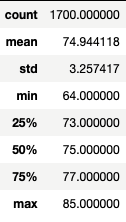
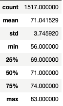
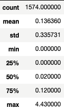
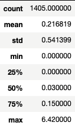

# surfs_up

## Overview
### Purpose
After performing the initial weather analysis of Oahu weather, W. Avy wants to see more specific temperature data trends for the months of June and December before opening the surf shop. This analysis will help in determining if the surf and ice cream shop business is sustainable year-round. My task was simply to compute the summary statistics for June and Decemeber.

## Results
### June vs. Decemeber Weather
June:

December:

* The average temperature of June and December only differ by about three degrees despite the two months being in the summer and winter seasons
* Maximum temperatures in June and December only differ by two degrees, while minimum temperatures differ by eight degrees
* December has a slightly higher standard deviation than June, which means that December experiences a larger variation in temperature than June

## Summary
### Temperature
After a brief analysis, I determined that Oahu does not experience a drastic change in temperature from June to December like a lot of places around the world do. The average temperature drops about three degrees from June to December, and the most noticeable difference can be seen by the eight degree difference in minimum temperature. Based on the standard deviation of the temperature of each month, December experiences a larger temperature range than June does. Based on these findings, I believe that the surf and ice cream shop can be sustainable year-round, but I would like to do further analysis to cement this belief.

### Precipitation
I performed two additional queries to find the precipitation data trends for both of these months. After analysis, I found that Oahu experiences more rain on average in December than June along with more variation in December precipitation. Additionally, the December maximum precipitation level was much higher than June's. These additional queries complicate this business decision for W. Avy as a surf and ice cream shop may not fair as well in December when it is raining more.

June:

December:

